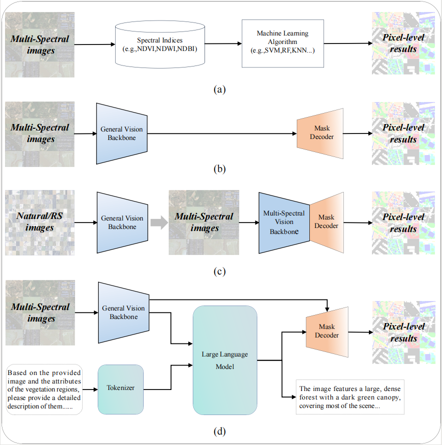
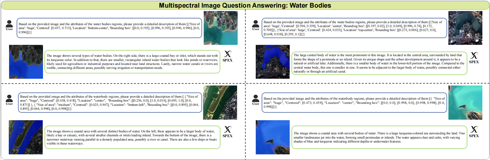

<p align="center">
  <h2 align="center"><strong>SPE:A Vision-Language Model for Land Cover Extraction on Spectral Remote Sensing Images</strong></h2>
<p align="center">
<div align="center">
<h5>
<em>Dongchen Si<sup>1,4,5 *</sup>, Di Wang<sup>2*</sup>, Erzhong Gao<sup>4,5 </sup>, Xiaolei Qin<sup>3 </sup>, Liu Zhao<sup>4,5</sup>, Jing Zhang<sup>2</sup>, Minqiang Xu<sup>4,5 †</sup>,Jianbo Zhan<sup>4,5 †</sup>,Jianshe Wang<sup>4,5</sup>,Lin Liu<sup>4,5</sup>,Bo Du<sup>2</sup>,Liangpei Zhang<sup>1</sup></em>
    <br><br>
       	<sup>1</sup> Xinjiang University, China,<br/>
        <sup>2</sup> School of Computer Science, Wuhan University, China,<br/> 
        <sup>3</sup> State Key Laboratory of Information Engineering in Surveying, Mapping and Remote Sensing, Wuhan University, China,<br/> 
       <sup>4</sup> iFlytek Co., Ltd, China,<br/> 
       <sup>5</sup>National Engineering Research Center of Speech and Language Information Processing, China,<br/> 
</h5>
<h5>
<sup>∗</sup> Equal contribution, <sup>†</sup> Corresponding author
</h5>
</div>


<h5 align="center">
<a href="https://arxiv.org/abs/2508.05202"> </a>
</h5>

# 🔥 Update
**2025.08.08**
- We uploaded our work on [arXiv](https://arxiv.org/abs/2508.05202).

# 🌞 Intro
Spectral information has long been recognized as a critical cue in remote sensing observations. Although numerous vision-language models have been developed for pixel-level interpretation, spectral information remains underutilized, resulting in suboptimal performance, particularly in multispectral scenarios. To address this limitation, we construct a vision-language instruction-following dataset named SPIE, which encodes spectral priors of land-cover objects into textual attributes recognizable by large language models (LLMs), based on classical spectral index computations. Leveraging this dataset, we propose SPEX, a multimodal LLM designed for instruction-driven land cover extraction. To this end, we introduce several carefully designed components and training strategies, including multiscale feature aggregation, token context condensation, and multispectral visual pre-training, to achieve precise and flexible pixel-level interpretation. To the best of our knowledge, SPEX is the first multimodal vision-language model dedicated to land cover extraction in spectral remote sensing imagery. Extensive experiments on five public multispectral datasets demonstrate that SPEX consistently outperforms existing state-of-the-art methods in extracting typical land cover categories such as vegetation, buildings, and water bodies. Moreover, SPEX is capable of generating textual explanations for its predictions, thereby enhancing interpretability and user-friendliness.

# 🔍 Overview
<figure>
<div align="center">

</div>
<div align="center">
<figcaption align = "center"><b>Figure 1. Comparison of various methods for land cover extraction. 
 </b></figcaption>
</div>
</figure>

# :eyes: Visualization
<figure>

</div>
<div align="center">
<figcaption align = "center"><b>Figure 2: Water body extraction examples with masks highlighted in blue.
 </b></figcaption>
</div>
</figure>

# 📖 Datasets
The SPIE dataset will be released soon.


# 🔨 Evaluation code
The code will be released soon.

# ⭐ Citation

If you find SPEX helpful, please consider giving this repo a ⭐ and citing:

```latex
@article{SPEX,
      title={SPEX: A Vision-Language Model for Land Cover Extraction on Spectral Remote Sensing Images}, 
      author={Dongchen Si and Di Wang and Erzhong Gao and Xiaolei Qin and Liu Zhao and Jing Zhang and Minqiang Xu and Jianbo Zhan and Jianshe Wang and Lin Liu and Bo Du and Liangpei Zhang},
      journal={arXiv preprint arXiv:2508.05202},
      year={2025}
}
```
